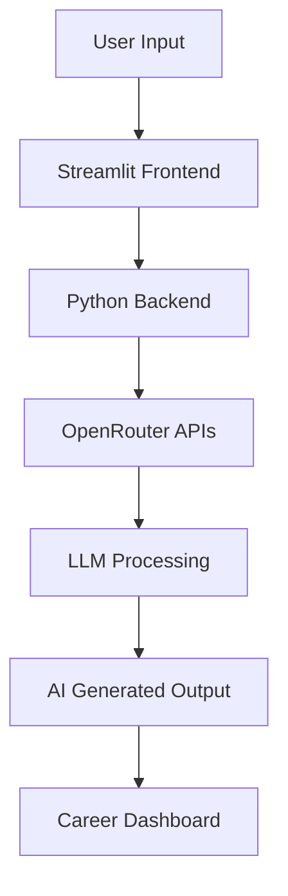

<div align="center">


<br>


<br><br>

<p align="center">
  
  
  
  
  
</p>

<br>


</div>

---

# 🌌 Overview

> **AI Career Copilot Pro** is a premium AI-powered career intelligence platform designed to help users optimize resumes, improve ATS performance, prepare for interviews, and generate personalized career roadmaps using modern Large Language Models.

<br>

<div align="center">

| Core Capability | Description |
|---|---|
| 📄 Resume Generation | ATS-optimized resume generation tailored for job roles |
| 📊 ATS Analysis | Resume scoring with intelligent feedback |
| 🧠 Interview Preparation | AI-generated interview questions & answers |
| 🛣️ Career Roadmaps | Personalized step-by-step learning plans |
| ⚡ AI SaaS Experience | Modern recruiter-focused AI platform |

</div>

---

# ✨ Features

<div align="center">

| Feature | AI Capability | Status |
|---|---|---|
| Resume Generator AI | ATS Resume Creation | ✅ |
| ATS Analyzer | Resume vs JD Matching | ✅ |
| Interview Preparation | Dynamic Q&A Generation | ✅ |
| Career Roadmap Generator | AI Learning Paths | ✅ |
| Session Authentication | User Session Management | ✅ |
| OpenRouter Integration | Multi-LLM Support | ✅ |

</div>

---

# 🧠 AI Modules

## 1️⃣ Resume Generator

| Input | AI Process | Output |
|---|---|---|
| Skills, projects, experience | ATS optimization + formatting | Professional recruiter-ready resume |

---

## 2️⃣ ATS Resume Analyzer

| Input | AI Process | Output |
|---|---|---|
| Resume + Job Description | Semantic keyword matching | ATS score + improvement suggestions |

---

## 3️⃣ Interview Preparation

| Input | AI Process | Output |
|---|---|---|
| Job role & experience level | AI interview simulation | Technical & HR interview Q&A |

---

## 4️⃣ Career Roadmap Generator

| Input | AI Process | Output |
|---|---|---|
| Target career role | Structured AI planning | Step-by-step growth roadmap |

---

# 🏗️ Architecture

<div align="center">

| Layer | Technology | Responsibility |
|---|---|---|
| Frontend | Streamlit | Interactive UI |
| Backend | Python | Application Logic |
| AI Layer | OpenRouter APIs | LLM Processing |
| Session Layer | Session State | Authentication |
| Output Layer | Markdown/Text | AI Responses |

</div>

---

# ⚡ Tech Stack

<div align="center">


<br><br>


</div>

---

# 📂 Project Structure

```bash
AI-Career-Copilot-Pro
│
├── app.py
├── requirements.txt
├── README.md
│
├── assets
│   ├── icons
│   ├── banners
│   └── images
│
├── modules
│   ├── resume_generator.py
│   ├── ats_analyzer.py
│   ├── interview_prep.py
│   └── roadmap_generator.py
│
├── auth
│   └── session_manager.py
│
├── utils
│   ├── prompts.py
│   ├── helpers.py
│   └── constants.py
│
└── data
    └── templates
```

---

# 🧬 System Workflow



---

# 📊 GitHub Analytics

<div align="center">


<br><br>


</div>

---

# 🐍 Contribution Snake

<div align="center">


</div>

---

# 🌐 Connect With Me

<div align="center">

<a href="https://github.com/pranjalsharma14">
  
</a>

<a href="https://www.linkedin.com/in/pranjalsharma56/">
  
</a>

<a href="mailto:pranjalsharma.works@gmail.com">
  
</a>

</div>

---

# 🚀 Support This Project

<div align="center">

<table>
<tr>
<td align="center" width="33%">

### ⭐ Star Repository

Support the project by starring the repository and increasing visibility.

</td>

<td align="center" width="33%">

### 🍴 Fork Project

Create your own version and build additional features.

</td>

<td align="center" width="33%">

### 📢 Share Project

Help others discover the project across developer communities.

</td>
</tr>
</table>

<br>

<a href="https://github.com/pranjalsharma14">
  
</a>

</div>

---

# 🔒 License & Usage

<div align="center">

### © All Rights Reserved — Pranjal Sharma

This project is protected under a proprietary license.

Unauthorized copying, distribution, modification, or commercial use of this software is strictly prohibited without explicit permission from the author.

</div>

---

<div align="center">

## ⚡ AI Career Copilot Pro

### Building Smarter Careers with AI

<br>


</div>
