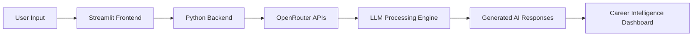

<p align="left">

</p>

---

# 🚀 What is AI Career Copilot Pro?

AI Career Copilot Pro is a modern AI-powered career intelligence platform built to help students, freshers, and professionals improve their job preparation process using Large Language Models (LLMs).

The platform combines multiple AI tools into one unified system so users can:

- Create ATS-optimized resumes
- Analyze resume-job compatibility
- Prepare for technical & HR interviews
- Generate personalized career roadmaps
- Get intelligent career guidance instantly

Unlike traditional resume builders or chatbot-based tools, AI Career Copilot Pro works like a complete AI SaaS platform focused on real-world recruitment workflows.

---

# 🎯 The Problem It Solves

Many candidates struggle during placements and job applications because:

- Their resumes fail ATS screening systems
- They don't know how recruiters evaluate profiles
- They lack structured interview preparation
- They follow random learning resources without direction
- They don't receive personalized career guidance

As a result, even skilled candidates often fail to get shortlisted.

AI Career Copilot Pro solves these issues using AI-driven analysis, automation, and personalized recommendations.

---

# ⚡ Core Capabilities

| Module | Purpose |
|---|---|
| Resume Generator AI | Creates recruiter-friendly ATS resumes |
| ATS Analyzer | Compares resume with job descriptions |
| Interview Preparation | Generates AI-based interview questions & answers |
| Career Roadmap Generator | Creates structured learning & growth plans |
| AI Career Guidance | Provides intelligent recommendations using LLMs |

---

# 🧠 How The AI System Works

```text
User Input
   ↓
Frontend Interface (Streamlit)
   ↓
Python Backend Processing
   ↓
OpenRouter LLM APIs
   ↓
AI Analysis & Generation
   ↓
Career Intelligence Output
```

---

# 💡 Example User Flow

```text
1. User uploads resume
        ↓
2. User pastes job description
        ↓
3. AI analyzes ATS compatibility
        ↓
4. System generates:
      • ATS Score
      • Missing Keywords
      • Improvement Suggestions
      • Optimized Resume Content
```

---

# 🔥 Why This Project Stands Out

AI Career Copilot Pro is designed like a real startup SaaS product rather than a basic student project.

The project focuses on:

- Production-style architecture
- Real-world AI implementation
- Practical recruitment use cases
- Modern UI/UX design
- Modular scalable backend structure
- Multi-feature AI workflow integration

This demonstrates strong understanding of:

- AI Product Engineering
- SaaS System Design
- LLM Integration
- Prompt Engineering
- Full Stack Development
- User-Centric Product Design

---

# 🏆 Developer Highlights

<p align="left">

</p>

<p align="left">


</p>

---

# ✨ Features

| Feature | Description | Status |
|---|---|---|
| Resume Generator AI | ATS-optimized resume generation | ✅ |
| ATS Analyzer | Resume vs JD semantic analysis | ✅ |
| Interview Preparation | AI-generated interview simulations | ✅ |
| Career Roadmap Generator | Personalized learning paths | ✅ |
| Session Authentication | Session-based access handling | ✅ |
| OpenRouter Integration | Multi-model LLM orchestration | ✅ |

---

# 🧠 AI Modules

## Resume Generator

| Input | Process | Output |
|---|---|---|
| Skills, projects, experience | ATS optimization & formatting | Recruiter-ready resume |

---

## ATS Resume Analyzer

| Input | Process | Output |
|---|---|---|
| Resume + Job Description | Semantic keyword analysis | ATS score + feedback |

---

## Interview Preparation

| Input | Process | Output |
|---|---|---|
| Role + Experience Level | AI interview generation | Technical & HR Q&A |

---

## Career Roadmap Generator

| Input | Process | Output |
|---|---|---|
| Target Career Role | AI planning engine | Step-by-step roadmap |

---

# 🏗️ Architecture

| Layer | Technology | Responsibility |
|---|---|---|
| Frontend | Streamlit | User Interface |
| Backend | Python | Application Logic |
| AI Layer | OpenRouter APIs | LLM Processing |
| Session Layer | Session State | Authentication |
| Output Layer | Markdown/Text | AI Responses |

---

# ⚙️ Tech Stack

<p align="left">


</p>

<p align="left">


</p>

---

# 📂 Project Structure

```text
AI-Career-Copilot-Pro/
│
├── app.py
├── requirements.txt
├── README.md
│
├── assets/
│   ├── icons/
│   ├── banners/
│   └── images/
│
├── modules/
│   ├── resume_generator.py
│   ├── ats_analyzer.py
│   ├── interview_prep.py
│   └── roadmap_generator.py
│
├── auth/
│   └── session_manager.py
│
├── utils/
│   ├── prompts.py
│   ├── helpers.py
│   └── constants.py
│
└── data/
    └── templates/
```

---

# 🧬 System Workflow



---

# 📊 GitHub Analytics

<p align="left">


</p>

<p align="left">


</p>

---

# 🐍 Contribution Snake

<p align="left">


</p>

---

# 🌐 Connect

<p align="left">

<a href="https://github.com/pranjalsharma14">
  
</a>

<a href="https://www.linkedin.com/in/pranjalsharma56/">
  
</a>

<a href="mailto:pranjalsharma.works@gmail.com">
  
</a>

</p>

---

# 🚀 Support This Project

<table>
<tr>

<td width="33%">

## ⭐ Star Repository

Support the project and increase visibility within the developer community.

</td>

<td width="33%">

## 🍴 Fork Project

Create your own version and experiment with additional AI workflows.

</td>

<td width="33%">

## 📢 Share Project

Share the repository with developers, recruiters, and AI enthusiasts.

</td>

</tr>
</table>

<br>

<p align="left">

<a href="https://github.com/pranjalsharma14">

</a>

</p>

---

# 🔒 Proprietary License

```text
Copyright © 2026 Pranjal Sharma

All Rights Reserved.

This repository and its source code are proprietary.

You may not:
- Copy
- Modify
- Distribute
- Reproduce
- Sell
- Use commercially

without explicit written permission from the author.

Unauthorized usage may result in legal action.
```

---

# ⚡ Final Note

AI Career Copilot Pro represents a production-style AI SaaS application focused on solving real-world career preparation problems through modern LLM orchestration, recruiter-focused workflows, and scalable architecture design.

<br>


